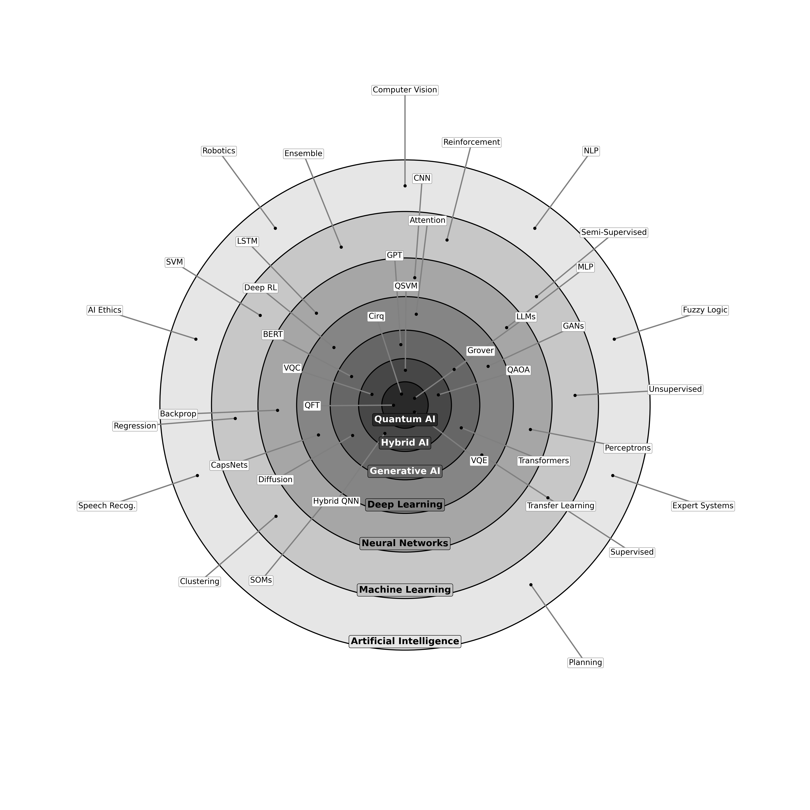

# The Applied AI Universe Coding Guide
### *From Neural Networks to Quantum AI*

## Interactive Notebooks

> GitHub may time out rendering large notebooks. Use the Colab badges to open and run them directly, or view them via nbviewer below.

### Classical AI Universe (Chapters 2-29)

[](https://colab.research.google.com/github/ericyoc/the_applied_ai_universe_coding_guide/blob/main/Applied_AI_Universe_Coding_Guide_Classical.ipynb)
[](https://nbviewer.org/github/ericyoc/the_applied_ai_universe_coding_guide/blob/main/Applied_AI_Universe_Coding_Guide_Classical.ipynb)

### Quantum & Hybrid AI Universe (Chapters 30-33)

[](https://colab.research.google.com/github/ericyoc/the_applied_ai_universe_coding_guide/blob/main/Applied_AI_Universe_Coding_Guide_Hybrid_Quantum.ipynb)
[](https://nbviewer.org/github/ericyoc/the_applied_ai_universe_coding_guide/blob/main/Applied_AI_Universe_Coding_Guide_Hybrid_Quantum.ipynb)

---

[](https://www.python.org/)
[](https://tensorflow.org/)
[](https://pennylane.ai/)
[](https://huggingface.co/)

---

<p align="center">
  
</p>

<p align="center">
  <em>The AI Universe -- seven concentric rings spanning every major sub-field of Artificial Intelligence through Quantum AI</em>
</p>

---

## Overview

This repository contains **two complete coding guides** built around *The Applied AI Universe* -- a concentric-ring taxonomy of artificial intelligence. Every labeled topic in the diagram has a dedicated markdown explanation, working code demo, and visual output.

**Classical Notebook** covers Chapters 2-29: from A* Planning and Expert Systems through Diffusion Models, LoRA, RLHF, and Mamba -- with 28 stretch goal extensions.

**Quantum Notebook** covers Chapters 30-33: QAOA, Quantum Kernel SVM, VQC, Hybrid QNN, QGAN, Bell States, Grover's Search, VQE, Quantum Teleportation, and ZZ Feature Maps -- with 4 stretch goal extensions.

```
Artificial Intelligence
  └── Machine Learning
        └── Neural Networks
              └── Deep Learning
                    └── Generative AI
                          └── Frontier AI (Diffusion, LoRA, RLHF, Mamba)
                                └── Hybrid Quantum / Quantum AI
```

> **Runtime Recommendation:** GPU (T4 or better)
> *Runtime -> Change runtime type -> T4 GPU*

---

## Notebooks

| Notebook | Chapters | Demos | Stretch Goals |
|----------|----------|-------|---------------|
| [Classical AI Universe](Applied_AI_Universe_Coding_Guide_Classical.ipynb) | 2-29 | 43 | 28 (SG-02 to SG-29) |
| [Quantum & Hybrid AI Universe](Quantum_Hybrid_AI_Universe_v3.ipynb) | 30-33 | 12 | 4 (SG-30 to SG-33) |

> **Note:** GitHub may time out rendering these notebooks. Use the Colab badges above to open and run them directly.

---

## Table of Contents

### Classical Notebook (Chapters 2-29)
- [Module 0 -- Setup & Environment](#module-0----setup--environment)
- [Module 1 -- Artificial Intelligence](#module-1----artificial-intelligence-outer-ring)
- [Module 2 -- Machine Learning](#module-2----machine-learning)
- [Module 3 -- Neural Networks](#module-3----neural-networks)
- [Module 4 -- Deep Learning](#module-4----deep-learning)
- [Module 5 -- Generative AI](#module-5----generative-ai)
- [Module 6 -- Frontier AI](#module-6----frontier-ai-chapters-26-29)
- [Stretch Goals SG-02 to SG-29](#stretch-goals-sg-02-to-sg-29)
- [Module 7 -- Summary](#module-7----summary)

### Quantum Notebook (Chapters 30-33)
- [Module 7 -- Hybrid Quantum-Classical AI](#module-7----hybrid-quantum-classical-ai-chapters-30-33)
- [Module 8 -- Quantum AI](#module-8----quantum-ai-chapters-31-33)
- [Stretch Goals SG-30 to SG-33](#stretch-goals-sg-30-to-sg-33)

---

## Prerequisites

| Requirement | Details |
|-------------|---------|
| Platform | Google Colab (free tier works; GPU recommended) |
| Google Account | Required for Drive mounting |
| Python | 3.10+ (pre-installed in Colab) |
| Prior Knowledge | Basic Python helpful but not required |

All libraries install automatically at runtime. No local setup needed.

---

## Classical Notebook (Chapters 2-29)

### Module 0 -- Setup & Environment

| Section | Description |
|---------|-------------|
| 0.1 | Mount Google Drive -- saves all outputs to `AI_Universe_Coding_Guide/` |
| 0.2 | Install & import all required libraries |
| 0.3 | AI Universe concentric rings overview diagram (code-generated) |

---

### Module 1 -- Artificial Intelligence (Outer Ring)

| Chapter | Topic | Dataset | Key Output |
|---------|-------|---------|------------|
| Ch 2 | A* Planning -- BFS and A* Search | Synthetic 7x7 grid | Path grid chart, algorithm comparison table |
| Ch 3 | Expert Systems -- Forward Chaining | Custom medical rules | Diagnoses table |
| Ch 4 | Fuzzy Logic -- AI Deployment Risk | Custom control system | Membership function plots, risk assessment table |

---

### Module 2 -- Machine Learning

| Chapter | Topic | Dataset | Key Output |
|---------|-------|---------|------------|
| Ch 5 | Feature Engineering | Breast Cancer | Importance bar chart, correlation heatmap, accuracy vs k |
| Ch 6 | Supervised Learning -- 6 Classifiers | Iris | Accuracy comparison table, Decision Tree visualization |
| Ch 7 | Semi-Supervised Learning -- Label Spreading | Digits (10% labeled) | SSL vs supervised bar chart |
| Ch 8 | Regression -- Linear & Polynomial | Synthetic sine wave | Poly fit curves (degree 1, 3, 9) |
| Ch 9 | Unsupervised -- K-Means + PCA | Iris | Elbow curve, cluster map, true label comparison |
| Ch 10 | Dimensionality Reduction -- PCA vs t-SNE | Digits (64 features) | Scatter plots, cumulative variance curve |
| Ch 11 | Ensemble Learning -- Bagging, Boosting, Voting | Synthetic | Ensemble accuracy bar chart |

---

### Module 3 -- Neural Networks

| Chapter | Topic | Dataset | Key Output |
|---------|-------|---------|------------|
| Ch 10 | Activation Functions | Synthetic | 6-function comparison plot with derivatives |
| Ch 11 | Perceptron from Scratch | Logic gates (AND/OR) | Learned decision boundary |
| Ch 12 | MLP -- MNIST | MNIST | Training curves, confusion matrix, 98%+ accuracy |
| Ch 12 | Backpropagation from Scratch | XOR problem | Loss curve, gradient norm curves, W1 heatmap |
| Ch 13 | CNN -- MNIST | MNIST | Learned conv filters, 99%+ accuracy |
| Ch 13 | LSTM / RNN / GRU | Sine wave | Forecast plot (3 models), MSE comparison |
| Ch 14 | Self-Organizing Maps | Iris | U-matrix, activation frequency map |

---

### Module 4 -- Deep Learning

| Chapter | Topic | Dataset | Key Output |
|---------|-------|---------|------------|
| Ch 15 | DNN Depth Study | CIFAR-10 | Depth vs accuracy table, sample image grid |
| Ch 16 | Transfer Learning -- MobileNetV2 | CIFAR-10 (5k samples) | Fine-tune accuracy curves, 83%+ on 5k samples |
| Ch 17 | GAN -- MNIST Digit Generation | MNIST | 5x5 generated digit grid, D/G loss curves |
| Ch 18 | Attention Mechanism | Synthetic sequences | 8x8 attention weight heatmap |
| Ch 19 | Dropout Regularization | MNIST | Overfit gap comparison, 3-setting bar chart |
| Ch 20 | Q-Learning -- GridWorld | GridWorld (5x5) | Smoothed reward curve, learned policy grid |
| Ch 21 | Capsule Networks | MNIST (10k subset) | Routing coupling heatmap, accuracy curves |
| Ch 22 | Deep Belief Networks -- Stacked RBMs | MNIST (10k subset) | RBM filter visualization, accuracy comparison |

---

### Module 5 -- Generative AI

| Chapter | Topic | Dataset | Key Output |
|---------|-------|---------|------------|
| Ch 22 | N-Gram Language Model | Alice in Wonderland | Token frequency chart, next-word probabilities |
| Ch 23 | Transformer from Scratch | IMDb (25k reviews) | Accuracy curves, 83%+ sentiment accuracy |
| Ch 24 | HuggingFace Pipelines -- NLU, Generation, Summarization | DistilBERT / BART / GPT-2 | Sentiment table, zero-shot classification, summary, generated text |
| Ch 25 | Dialogue Systems -- Retrieval-Based Chatbot | Custom KB (8 Q&A pairs) | TF-IDF similarity heatmap, confidence scores |

---

### Module 6 -- Frontier AI (Chapters 26-29)

| Chapter | Topic | Dataset | Key Output |
|---------|-------|---------|------------|
| Ch 26 | Diffusion Models -- DDPM on MNIST | MNIST | 2x8 generated digit grid, training loss curve |
| Ch 27 | LoRA / PEFT -- GPT-2 Fine-Tuning | Custom text corpus | Trainable params comparison, generated text |
| Ch 28 | RLHF -- PPO Alignment | GPT-2 | Reward curve, KL divergence plot |
| Ch 29 | Mamba / State Space Models | Synthetic copy task | Loss curve, copy accuracy |

---

### Stretch Goals SG-02 to SG-29

One hands-on coding extension per chapter, going beyond the base listing.

| Stretch Goal | Chapter | Topic |
|--------------|---------|-------|
| SG-02 | Ch 2 | A* diagonal heuristic + weighted terrain (8-directional movement) |
| SG-03 | Ch 3 | Expert system + confidence scores + Pneumonia rule |
| SG-04 | Ch 4 | Fuzzy system + model age as third input variable |
| SG-05 | Ch 5 | Polynomial features + correlation filter pipeline |
| SG-06 | Ch 6 | +2 classifiers (Naive Bayes, AdaBoost) + stratified cross-validation |
| SG-07 | Ch 7 | DBSCAN + hierarchical clustering + dendrogram |
| SG-08 | Ch 8 | Self-training SSL loop with confidence threshold |
| SG-09 | Ch 9 | Stacking ensemble with meta-learner |
| SG-10 | Ch 10 | GELU from scratch + MLP activation comparison |
| SG-11 | Ch 11 | Pocket Algorithm on noisy XOR |
| SG-12 | Ch 12 | 3-layer backprop + L2 weight decay |
| SG-13 | Ch 13 | TCN vs LSTM on sine wave |
| SG-14 | Ch 14 | SOM on 64-feature Digits dataset |
| SG-15 | Ch 15 | CNN depth study vs MLP on CIFAR-10 |
| SG-16 | Ch 16 | Unfreeze top 20 layers fine-tuning (two-phase) |
| SG-17 | Ch 17 | Conditional GAN (cGAN) -- 2 samples per digit class |
| SG-18 | Ch 18 | Causal masked self-attention visualization |
| SG-19 | Ch 19 | MC Dropout uncertainty estimation |
| SG-20 | Ch 20 | Double DQN vs vanilla Q-Learning |
| SG-21 | Ch 21 | Routing-by-agreement coupling coefficient heatmap |
| SG-22 | Ch 22 | Add-k smoothing + linear interpolation, perplexity comparison |
| SG-23 | Ch 23 | 2-block Transformer + attention weight visualization |
| SG-24 | Ch 24 | DistilBERT fine-tune vs zero-shot BART accuracy/speed comparison |
| SG-25 | Ch 25 | TF-IDF dense retrieval RAG similarity heatmaps |
| SG-26 | Ch 26 | Cosine vs linear noise schedule comparison |
| SG-27 | Ch 27 | LoRA rank sweep r=1,4,8,16 -- params vs loss vs time |
| SG-28 | Ch 28 | RLHF length-based reward hacking demonstration |
| SG-29 | Ch 29 | Mamba vs LSTM at sequence lengths 64, 128, 256 |

---

### Module 7 -- Summary

Color-coded summary tables for all 43 classical demos and all 28 stretch goals. Saved as `07_summary_table.png` and `07_stretch_goals_summary.png`.

---

## Quantum Notebook (Chapters 30-33)

### Module 7 -- Hybrid Quantum-Classical AI (Chapters 30-33)

| Chapter | Section | Topic | Library | Simulator | Qubits |
|---------|---------|-------|---------|-----------|--------|
| Ch 30 | 7.1 | QAOA Max-Cut | PennyLane | default.qubit | 4 |
| Ch 30 | 7.2 | Quantum Kernel SVM | PennyLane + sklearn | default.qubit | 2 |
| Ch 31 | 7.3 | Variational Quantum Classifier (VQC) | PennyLane | default.qubit | 4 |
| Ch 32 | 7.4 | Hybrid Quantum-Classical Neural Network | PennyLane + PyTorch | default.qubit | 4 |
| Ch 33 | 7.5 | Quantum GAN (QGAN) | PennyLane + PyTorch | default.qubit | 2 |
| Ch 30 | 8.7 | QAOA Depth Sweep p=1,2,3 | PennyLane | default.qubit | 4 |
| Ch 33 | 8.8 | VQE H2 Potential Energy Surface | PennyLane | default.qubit | 4 |

---

### Module 8 -- Quantum AI (Chapters 31-33)

| Chapter | Section | Topic | Library | Simulator | Qubits |
|---------|---------|-------|---------|-----------|--------|
| Ch 31 | 8.1 | Bell States + GHZ State | IBM Qiskit | AerSimulator | 3 |
| Ch 31 | 8.2 | Grover's Search Algorithm | IBM Qiskit | AerSimulator | 3 |
| Ch 32 | 8.3 | VQE -- Ising Hamiltonian | PennyLane | default.qubit | 2 |
| Ch 33 | 8.4 | Quantum Teleportation | Google Cirq | cirq.Simulator | 3 |
| Ch 33 | 8.5 | ZZ Quantum Feature Maps | PennyLane | default.qubit | 2 |

---

### Stretch Goals SG-30 to SG-33

| Stretch Goal | Chapter | Topic |
|--------------|---------|-------|
| SG-30 | Ch 30 | QAOA depth sweep p=1-4 on 4-node and 6-node graphs |
| SG-31 | Ch 31 | Grover 4-qubit search for target state |1010> |
| SG-32 | Ch 32 | Goemans-Williamson SDP baseline vs QAOA comparison |
| SG-33 | Ch 33 | VQE COBYLA vs Adam optimizer -- convergence comparison |

---

## Complete Topic Coverage

### Classical Demos (43 Topics)

| Ring | Count | Topics |
|------|-------|--------|
| Artificial Intelligence | 3 | A* Planning, Expert Systems, Fuzzy Logic |
| Machine Learning | 7 | Feature Engineering, Supervised Learning, Semi-Supervised, Regression, K-Means+PCA, Dimensionality Reduction, Ensemble Learning |
| Neural Networks | 7 | Activation Functions, Perceptron, MLP, Backpropagation, CNN, LSTM/RNN/GRU, SOMs |
| Deep Learning | 8 | DNN Depth, Transfer Learning, GAN, Attention, Dropout, Q-Learning, CapsNet, DBNs |
| Generative AI | 4 | N-Gram LM, Transformer, HuggingFace Pipelines, Dialogue Systems |
| Frontier AI | 4 | Diffusion DDPM, LoRA/PEFT, RLHF PPO, Mamba SSM |
| Stretch Goals | 28 | SG-02 through SG-29 |

### Quantum Demos (16 Topics)

| Ring | Count | Topics |
|------|-------|--------|
| Hybrid Quantum | 7 | QAOA, Quantum Kernel SVM, VQC, Hybrid QNN, QGAN, QAOA Depth Sweep, VQE H2 PES |
| Quantum AI | 5 | Bell States+GHZ, Grover's Search, VQE, Quantum Teleportation, ZZ Feature Maps |
| Stretch Goals | 4 | SG-30 through SG-33 |

---

## Technologies Used

### Classical Notebook

| Technology | Role |
|------------|------|
| TensorFlow / Keras 2.x | MLP, CNN, LSTM, GAN, Transformer, CapsNet, DDPM |
| scikit-learn 1.x | Classical ML, preprocessing, evaluation |
| HuggingFace Transformers 4.x | DistilBERT, BART, GPT-2 |
| PyTorch | RLHF PPO, Mamba SSM |
| PEFT / LoRA | Parameter-efficient fine-tuning |
| NumPy / Pandas | Numerical computation, data tables |
| Matplotlib / Seaborn | All visualizations |
| MiniSom | Self-Organizing Maps |
| scikit-fuzzy | Fuzzy Logic inference |

### Quantum Notebook

| Technology | Role |
|------------|------|
| PennyLane | QAOA, VQC, Hybrid QNN, QGAN, VQE, Feature Maps |
| IBM Qiskit / AerSimulator | Bell States, Grover's Search |
| Google Cirq | Quantum Teleportation |
| cvxpy | Goemans-Williamson SDP baseline (SG-32) |
| PyTorch | Hybrid quantum-classical training |

---

## Output Files

All charts save automatically to `MyDrive/AI_Universe_Coding_Guide/`.

### Classical Outputs
```
00_ai_universe_overview.png
01_planning_search.png
01_expert_system.png
01x_fuzzy_logic.png
02x_feature_engineering.png
02_ml_classifiers.png
02x_semi_supervised.png
02_regression.png
02_kmeans_pca.png
02_pca_tsne.png
02_ensemble.png
03_activation_functions.png
03_perceptron.png
03_mlp_mnist.png
03_mlp_confusion.png
03x_backpropagation.png
03_cnn_filters.png
03_lstm_rnn.png
03_som.png
04_cifar10_samples.png
04_transfer_learning.png
04_gan_generated.png
04_gan_loss.png
04_attention.png
04_dropout.png
04_qlearning.png
04x_capsnet.png
04x_dbn_filters.png
05_ngram_lm.png
05_transformer.png
05_chatbot_similarity.png
07_ddpm_samples.png
07_rlhf_training.png
07_mamba_loss.png
07_summary_table.png
07_stretch_goals_summary.png
```

### Quantum Outputs
```
07_1_qaoa_maxcut.png
07_2_quantum_kernel_svm.png
07_3_vqc_classifier.png
07_4_hybrid_qnn.png
07_5_qgan.png
08_1_bell_states.png
08_2_grover_search.png
08_3_vqe.png
08_4_cirq_teleportation.png
08_5_quantum_feature_maps.png
07_qaoa_depth_sweep.png
08_8_vqe_pes.png
09_quantum_summary.png
```

---

## Next Steps

| Direction | Resource |
|-----------|---------|
| Foundational paper | *Attention Is All You Need* -- Vaswani et al. (2017) |
| Practice competitions | [Kaggle](https://www.kaggle.com) |
| Pretrained model hub | [HuggingFace](https://huggingface.co/models) |
| Adversarial ML | Goodfellow et al., *Explaining and Harnessing Adversarial Examples* |
| Quantum ML | Biamonte et al., *Quantum Machine Learning* (Nature, 2017) |
| Federated Learning | McMahan et al., *Communication-Efficient Learning* |
| AI Safety & Ethics | [AI Now Institute](https://ainowinstitute.org) |

---

## Disclaimer

This repository is intended for **educational purposes only**. All code demonstrations are provided as-is to illustrate AI and quantum computing concepts. Results, accuracy metrics, and model outputs will vary depending on runtime environment, library versions, and hardware. No guarantees are made regarding the suitability of any technique demonstrated here for production use. Quantum circuit simulations are performed entirely on classical hardware using software simulators (PennyLane `default.qubit`, IBM Qiskit `AerSimulator`, Google Cirq) — no physical quantum hardware is used. All datasets used are publicly available benchmarks. This work reflects the views of the author and not those of any affiliated institution.
